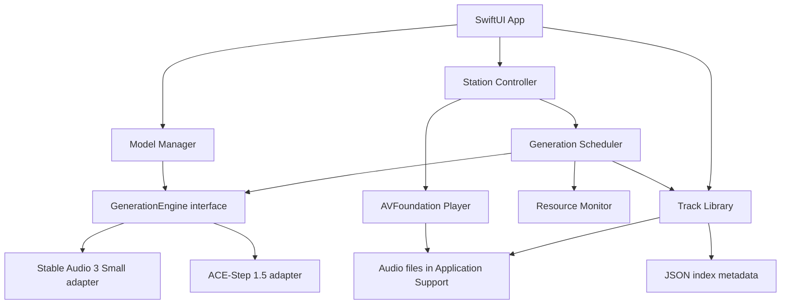

# Flowtone — Product Requirements Document

**Версия:** 0.2

**Статус:** Реализован локальный MVP, требуется hardware beta

**Дата:** 2026-08-17

**Владелец продукта:** mayky77-glitch

**Репозиторий:** [mayky77-glitch/Flowtone](https://github.com/mayky77-glitch/Flowtone)

## Change Log

| Версия | Дата | Изменение |
|---|---|---|
| 0.1 | 2026-08-16 | Первая версия после продуктового интервью и feasibility research |
| 0.2 | 2026-08-17 | Зафиксированы двухминутные треки, режимы хранения, автоматические профили, transport/vinyl UX и resource policy |

## Статусы неизвестного

- 🔶 **Assumption** — правдоподобное, но ещё не проверенное допущение.
- 🔵 **Open Question** — решение или факт, который ещё нужно получить.

---

## 1. Executive Summary

Flowtone — бесплатное open-source приложение для владельцев Apple Silicon Mac, которым нужна фоновая музыка для работы и концентрации. Пользователь задаёт жанры, темп эфира, настроение и при желании текстовый вайб; точный BPM и жанровый профиль Flowtone выбирает автоматически. После этого Flowtone локально генерирует двухминутные инструментальные треки и воспроизводит их как непрерывную радиостанцию. Продукт убирает поиск плейлистов, рекламу, подписку и зависимость от интернета. Успех MVP означает, что пользователь может слушать станцию не менее часа без поиска другой музыки; длительное ручное тестирование владелец продукта выполнит самостоятельно.

🔶 **Assumption:** проблема характерна не только владельцу проекта, но и заметной группе пользователей Mac, работающих под фоновую музыку. Сейчас гипотеза основана только на личном опыте.

---

## 2. Problem Statement

### Кто сталкивается с проблемой

Основная аудитория — люди, которые работают или учатся за Mac и используют инструментальную музыку для концентрации: разработчики, дизайнеры, авторы, аналитики, студенты и другие knowledge workers.

### Проблема

Чтобы поддерживать подходящий музыкальный фон, пользователь вынужден искать плейлисты, переключать неподходящие треки, терпеть рекламу либо оплачивать подписку. Эти действия прерывают рабочий фокус. Стриминговые сервисы также зависят от сети и не дают пользователю полностью локальный генеративный поток.

### Почему это болезненно

- Переключение контекста ради выбора музыки мешает глубокой работе.
- Готовый плейлист может не соответствовать текущему темпу, энергии или настроению.
- Реклама и ограничения бесплатных тарифов создают дополнительные прерывания.
- Зависимость от интернета ухудшает автономность и приватность.
- Пользователь должен управлять музыкой вместо того, чтобы один раз настроить фон.

### Доказательства

- **Подтверждено:** личный опыт владельца продукта.
- 🔶 **Assumption:** другие пользователи описывают проблему теми же словами и считают её достаточно сильной для установки локальной модели размером несколько гигабайт.
- 🔵 **Open Question:** насколько часто потенциальные пользователи переключают музыку во время работы и готовы ли они заменить привычный стриминговый сервис.

### Discovery до публичной beta

Провести 5–8 интервью с владельцами Apple Silicon Mac, которые слушают музыку во время работы. Проверить текущие привычки, частоту прерываний, отношение к локальной модели, допустимый размер загрузки и качество, при котором они готовы слушать Flowtone не менее часа.

---

## 3. Target Users & Jobs-to-Be-Done

### Primary Persona

**Имя:** Алекс

**Контекст:** работает за Apple Silicon Mac по 1–8 часов в день, техническая подготовка средняя или высокая, регулярно включает фоновую музыку.

**Цель:** быстро войти в состояние концентрации и не управлять музыкой во время рабочей сессии.

**Боли:** поиск плейлистов, неуместные треки, реклама, интернет-зависимость, слишком активная или вокальная музыка.

**Текущее поведение:** выбирает готовый плейлист или радио, периодически переключает треки и меняет подборку.

🔶 **Assumption:** Алекс согласен один раз загрузить 2–10 ГБ моделей ради автономной работы.

### Jobs-to-Be-Done

- **Functional job:** «Когда я начинаю работу, я хочу один раз выбрать характер музыки и получить непрерывный инструментальный фон без дальнейшего управления».
- **Emotional job:** сохранять ощущение контроля, приватности и спокойствия, не отвлекаясь на музыкальный выбор.
- **Social job:** не является основным для MVP.

### Основной контекст

Сессия может длиться от короткого рабочего интервала до полного рабочего дня. Искусственного ограничения длительности нет.

---

## 4. Strategic Context

### Цель продукта

Проверить, может ли полностью локальная генерация стать практичной заменой фоновому стриминговому радио на Apple Silicon Mac без постоянной высокой нагрузки.

### Почему сейчас

- Современные Apple Silicon Mac имеют unified memory и локальные ML runtime, достаточные для компактных аудиомоделей.
- [Stable Audio 3](https://github.com/Stability-AI/stable-audio-3) предоставляет официальный Mac-путь для Small-модели.
- [ACE-Step 1.5](https://github.com/ace-step/ACE-Step-1.5) даёт более тяжёлый экспериментальный quality tier с Apple Silicon/MLX-путём.
- Уже существуют локальные движки и desktop-прототипы, но не найден готовый продукт с точным UX-контрактом Flowtone: настройка рабочей станции, низконагруженный буфер, постоянная коллекция и локальное бесконечное радио.

### Дифференциация

- Весь пользовательский контент и генерация остаются на Mac.
- UX начинается не с технического prompt-поля, а с параметров станции.
- Непрерывность важнее обязательной уникальности: при перегрузке или выключенной генерации разрешены повторы.
- Flowtone предлагает лёгкий и тяжёлый local engine, рекомендуя вариант по характеристикам Mac.
- Каждый созданный трек становится частью локальной коллекции.

### Модель распространения

- Бесплатное open-source приложение.
- Исходный код Flowtone распространяется под MIT License.
- Первая публичная сборка: unsigned arm64 ZIP с `Flowtone.app`, русской инструкцией, MIT license и SHA-256 как GitHub Actions artifact при push/tag, срок хранения 14 дней; GitHub Release не создаётся.
- Веса моделей не входят автоматически в MIT-лицензию Flowtone и регулируются отдельными upstream terms.
- Unsigned-приложение может показать предупреждение Gatekeeper; пользователь должен самостоятельно разрешить запуск.

### Market Opportunity

TAM/SAM/SOM не рассчитывались. Для текущего open-source MVP это не блокирует technical spike, но ограничивает достоверность продуктового обоснования.

---

## 5. Solution Overview

### 5.1 Пользовательский сценарий

1. Пользователь скачивает unsigned `Flowtone-1.0.1-macos-arm64-unsigned.zip` из GitHub Actions artifacts и распаковывает приложение.
2. Приложение определяет chip и объём unified memory.
3. Flowtone рекомендует лёгкую или тяжёлую модель; пользователь может изменить выбор.
4. Flowtone показывает официальные страницы условий модели и просит пользователя подтвердить, что он лично их прочитал; эта отметка не принимает terms за пользователя. После подтверждения приложение само скачивает проверенный MLX runtime и публичный optimized Small-Music bundle, устанавливает их в Application Support и подключает генерацию.
5. Пользователь выбирает жанровые фильтры, темп эфира и настроение; все жанры можно выбрать или снять одной командой. Звуковой профиль выбирается автоматически. Можно включить случайный жанровый микс; точный BPM подбирается автоматически.
6. При желании добавляет свободное текстовое описание вайба.
7. Flowtone запускает станцию и поддерживает очередь готовых треков.
8. Во время сессии пользователь может менять параметры; новые значения применяются со следующего трека, текущий доигрывает.
9. При повторном запуске Flowtone немедленно включает случайный совместимый трек из локальной коллекции. При пустой коллекции показывает прогресс первой генерации.
10. Пользователь может поставить лайк, повторить, удалить трек, открыть любимые записи и статистику хранилища.

### 5.2 Ключевые функции MVP

- Station setup: 29 жанров, 350 автоматически меняющихся звуковых профилей, случайный жанровый микс, темп эфира, настроение, необязательный vibe prompt и автоматический genre-aware BPM.
- Непрерывный player: play/pause, previous/next, точный seek, ±15 секунд, начало/конец, громкость, плавные переходы и vinyl scratch.
- Последовательная фоновая генерация с опережающим буфером.
- Переключатель «Генерация включена/выключена».
- Автоматическая пауза генерации при высокой температуре или memory pressure.
- Повтор существующих треков как штатный fallback.
- Выбор local engine с автоматической рекомендацией.
- Автоматическая установка лёгкой модели без Terminal: зафиксированные official source/uv archives, SHA-256 verification, progress/cancel и offline-режим после загрузки.
- Session history, перемешивание без близких повторов, лайк, раздел «Любимые», запуск любого трека из коллекции и локальная коллекция.
- «Полное радио» с временным окном current/previous/queue и «Радио с записью» с постоянной коллекцией.
- Статистика: число и размер всех треков, число и размер по жанрам.
- Настраиваемый storage limit, индивидуальное удаление и «Удалить всё без лайка».
- При заполнении storage limit новые файлы не создаются; пользователь получает popup и освобождает место вручную либо увеличивает лимит.
- Адаптивный винил с 60-Гц вращением только в видимом окне, реальным progress тонарма и ручным scratch/seek.

### 5.3 Архитектура

### 5.4 Рекомендуемый стек

| Область | Выбор | Причина |
|---|---|---|
| UI | Swift 6, SwiftUI | Нативный macOS UX и небольшая runtime-надстройка |
| Playback | AVFoundation, `AVAudioEngine`/`AVAudioPlayerNode` | Gapless scheduling, crossfade и управление render clock |
| Concurrency | Swift Concurrency, actors | Один владелец очереди, отсутствие параллельных generation jobs |
| Metadata | Versioned compact JSON index | Малый объём, атомарная запись, простая локальная миграция без отдельного runtime |
| Audio storage | Application Support | Локальные WAV и временный `Incoming/` cache |
| Light inference | Stable Audio 3 Small через Core ML или MLX adapter | Компактный instrumental engine с официальным Mac-путём |
| Heavy inference | ACE-Step 1.5 через изолированный MLX/helper process | Более тяжёлый quality tier без блокировки UI процесса |
| Packaging | Xcode, unsigned app zip artifact | Простая доставка через GitHub Actions без GitHub Release, signing и notarization |
| Tests | Swift Testing, smoke/integration harness, короткие runtime checks | Проверка scheduler, storage и непрерывности; длительное ручное тестирование выполняет владелец |

Metadata contract реализован как `library-v1.json`; переход на базу данных не нужен, пока размер индекса не подтвердит обратное.

### 5.5 Контракты компонентов

#### Station Controller

- Хранит активную конфигурацию станции и pending-конфигурацию.
- Изменения во время трека не влияют на current track.
- Передаёт pending-конфигурацию следующему generation job.
- Управляет переключателем генерации и fallback-политикой.

#### Prompt Composer

Преобразует параметры в структурированный prompt: жанр/веса жанров, tempo, energy, mood, optional vibe, instrumental-only и negative constraints для вокала.

Отдельный LLM в MVP не нужен: он увеличивает RAM и сложность. Свободный текст передаётся audio engine после лёгкой локальной нормализации и фильтрации. 🔵 **Open Question:** нужна ли маленькая локальная LLM позже для лучшей интерпретации русского вайба.

#### Generation Scheduler

- Не более одной generation job одновременно.
- Генерирует следующий трек, когда запас готового аудио падает ниже low-water mark.
- Проверяет thermal state, Low Power Mode и memory pressure перед стартом.
- При `thermalState == serious/critical` или существенном memory pressure откладывает job; если pressure приходит во время генерации, активный process отменяется, а незавершённый кэш очищается.
- После трёх последовательных ошибок открывает circuit breaker и переводит станцию в collection-only режим до ручного retry или cooldown.

Утверждённый контракт: трек ровно 120 секунд, crossfade до 6 секунд, current + 2 ready tracks. Продление и stitching не входят в MVP.

#### Playback Engine

- Планирует переходы по audio render clock, а не UI timer.
- Не ждёт модель и играет только готовые файлы.
- Не прерывает current track при изменении настроек.
- Если ready queue пуста, выбирает least-recently-played совместимый трек; при старте станции выбор случайный среди совместимых.
- Crossfade использует equal-power curve; loudness normalization и автоматическая проверка качества остаются отдельным будущим улучшением.

#### Model Manager

- Определяет hardware class и рекомендует engine.
- Показывает размер, требования, лицензию и ожидаемую нагрузку.
- После личного подтверждения чтения official terms автоматически скачивает только зафиксированный Stable Audio 3 Small MLX stack, проверяет source/uv archives по SHA-256 и устанавливает его в Application Support.
- Не хранит пользовательский токен и не выполняет `curl | bash`; optimized weights скачиваются официальным runtime из публичного Stability AI repository.
- Проверяет наличие Python/MLX environment, четырёх Small-Music weight files и исполняемого light runtime по фиксированному локальному пути; затем generation запускается строго offline.
- Quality tier честно показывает отсутствие ACE-Step adapter и не запускает скрытую установку.

#### Track Library

Минимальная metadata-схема:

- `id`, `createdAt`, `lastPlayedAt`, `playCount`;
- жанры, автоматически выбранный genre profile, station pace, tempo, mood, vibe;
- engine, model version, seed и параметры генерации;
- duration, format, file path, byte size;
- `liked`, `generationStatus`, `qualityStatus`.

Каждый успешно созданный трек сохраняется. До generation request Flowtone проверяет, помещается ли следующий WAV в пользовательский лимит; после генерации выполняется повторная проверка по точному размеру. При нехватке места временный файл удаляется, появляется popup, а новые записи приостанавливаются. Существующая коллекция продолжает играть. Автоматического удаления ради следующей генерации нет: пользователь удаляет отдельные записи, запускает «Удалить всё без лайка» или увеличивает лимит.

При массовой очистке приложение показывает число и объём затронутых файлов и требует подтверждение.

### 5.6 Модельные tiers

| Tier | Предварительный engine | Hardware | Статус |
|---|---|---|---|
| Light | Stable Audio 3 Small-Music | M1+, 8 ГБ minimum; 16 ГБ recommended | Основной кандидат MVP |
| Quality | ACE-Step 1.5 | 24 ГБ+ recommended | Экспериментальный, зависит от benchmark |

Все hardware-пороги — 🔶 **Assumption**. Нужны короткие smoke/runtime проверки минимум на M1/8 ГБ, M1 или M2/16 ГБ и современном Mac/24–32 ГБ.

Stable Audio code и model weights имеют разные условия. Для весов действует [Stable Audio Community License](https://stability.ai/license). ACE-Step также требует отдельной проверки code/model/data terms перед релизом.

### 5.7 Оценка хранилища

При 120-секундных WAV 44.1 kHz stereo 16-bit один трек занимает около 21 МБ. С crossfade 6 секунд получается около 31.6 новых трека в час, то есть примерно 0.67 ГБ/час.

🔶 **Assumption:** архивное хранение в M4A/AAC 256 kbps уменьшит объём примерно до 3.8 МБ на трек. Нужно проверить, устраивает ли качество и не создаёт ли транскодирование заметную нагрузку.

---

## 6. Success Metrics

### Primary Metric

**Focus Session Success:** пользователь завершает минимум 60 минут прослушивания, не уходя искать другую музыку и не управляя очередью вручную.

- **Baseline:** отсутствует.
- **MVP acceptance:** сценарий проходит у владельца продукта.
- 🔵 **Open Question:** целевая доля успешных сессий во внешней beta после появления baseline.

### Reliability Metrics

| Метрика | Цель MVP |
|---|---|
| Buffer underruns в smoke/runtime checks | 0 |
| Необработанные падения в smoke/runtime checks | 0 |
| Старт воспроизведения из существующей коллекции | 🔶 не более 2 секунд |
| Потеря metadata после штатного завершения/перезапуска | 0 |
| Удаление лайкнутых файлов без явного действия пользователя | 0 |

### Resource Guardrails

- Flowtone не должен приводить систему в sustained `thermalState == critical`.
- UI и playback не должны зависать во время inference.
- Одновременно выполняется максимум одна generation job.
- При memory pressure или высокой температуре scheduler прекращает новые jobs и продолжает playback из коллекции.
- 🔵 **Open Question:** численные p50/p95 latency, peak memory и средняя duty cycle для каждого hardware tier определяются benchmark.

### Product Validation Metrics

Для beta измерять только локально либо собирать вручную в исследовании, поскольку usage analytics не входят в MVP:

- длительность сессии;
- число skips за час;
- доля сессий, закончившихся из-за неподходящей музыки;
- доля повторных запусков в течение недели;
- число лайков на час генерации.

---

## 7. User Stories & Requirements

### Epic Hypothesis

Мы считаем, что локальная инструментальная радиостанция с настройкой жанра и вайба позволит пользователям Mac работать не менее часа без поиска другой музыки, потому что Flowtone заранее генерирует подходящие треки и продолжает играть из локальной коллекции при любой доступности генератора. Проверка: 60-минутные пользовательские сессии, smoke/runtime checks и resource benchmark.

### Story 1 — Первый запуск и настройка модели

Как новый пользователь, я хочу понять, какая модель подходит моему Mac, и подключить её без Terminal.

**Acceptance Criteria:**

- [ ] Flowtone определяет Apple Silicon chip и объём unified memory.
- [ ] Показывает рекомендуемую модель и требования.
- [ ] Показывает официальные условия модели и даёт локально отметить их прочтение; отметка не принимает terms за пользователя.
- [ ] После подтверждения скачивает только Stable Audio 3 Small MLX, показывает этапы и позволяет отменить установку.
- [ ] Проверяет зафиксированные runtime archives по SHA-256, не сохраняет token/credentials и автоматически подключает offline generation.
- [ ] Незавершённая установка не выдаётся за готовую; повторная попытка использует уже загруженный model cache.

### Story 2 — Настройка станции

Как пользователь, я хочу выбрать характер музыки, чтобы получить подходящий фон для текущей работы.

**Acceptance Criteria:**

- [ ] Можно выбрать один или несколько жанров.
- [ ] Доступны «Спокойно / Ровно / Энергично» и понятное настроение эфира; точный tempo вводить не нужно.
- [ ] Текстовый vibe необязателен.
- [ ] Станция не запускается без обязательных параметров.
- [ ] Prompt содержит instrumental-only constraint.

### Story 3 — Непрерывное воспроизведение

Как пользователь, я хочу, чтобы музыка не останавливалась из-за генерации, чтобы не терять концентрацию.

**Acceptance Criteria:**

- [ ] Player использует готовые локальные файлы и не ждёт inference в audio callback.
- [ ] Scheduler поддерживает current + ready buffer.
- [ ] Между треками выполняется плавный переход без слышимой тишины.
- [ ] При пустом ready buffer выбирается существующий совместимый трек.
- [ ] Повтор разрешён при высокой нагрузке, ошибке или выключенной генерации.
- [ ] Короткие smoke/runtime checks проходят без buffer underrun.

### Story 4 — Изменение станции во время сессии

Как пользователь, я хочу менять жанровые фильтры, темп эфира, настроение и вайб без остановки музыки; BPM и звуковой профиль должны подстраиваться сами.

**Acceptance Criteria:**

- [ ] Изменения сохраняются как pending configuration.
- [ ] Текущий трек доигрывает без прерывания.
- [ ] Следующий generation job использует новые параметры.
- [ ] UI показывает, что изменения вступят в силу со следующего трека.

### Story 5 — Управление генерацией и fallback

Как пользователь, я хочу выключить генерацию или продолжить слушать при перегрузке Mac.

**Acceptance Criteria:**

- [ ] Есть переключатель «Генерация включена/выключена».
- [ ] Выключение не останавливает current track.
- [ ] При выключенной генерации станция использует локальную коллекцию.
- [ ] При thermal/memory pressure новая job не начинается.
- [ ] Пользователь видит ненавязчивый статус «Генерация приостановлена, играет коллекция».
- [ ] После нормализации ресурсов следующая попытка генерации снова разрешена, если переключатель включён.

### Story 6 — Выбор модели

Как пользователь, я хочу выбрать баланс качества и нагрузки, подходящий моему Mac.

**Acceptance Criteria:**

- [ ] Flowtone показывает рекомендованный tier.
- [ ] Пользователь видит light и quality tier с честным статусом доступности.
- [ ] Выбор выше рекомендуемого tier требует подтверждения предупреждения.
- [ ] Смена engine применяется к будущим generation jobs и не ломает playback.
- [ ] Переключение tier не удаляет созданные треки и не запускает скрытую загрузку.

### Story 7 — Лайки, история и режимы хранения

Как пользователь, я хочу сохранить удачные результаты и возвращаться к ним.

**Acceptance Criteria:**

- [ ] В режиме записи каждый успешно созданный трек появляется в истории и библиотеке.
- [ ] В полном радио сохраняется временное окно current/previous/queue; лайк делает запись постоянной.
- [ ] Лайк можно поставить и снять из player и библиотеки.
- [ ] Лайкнутый трек не попадает в массовую очистку без лайка.
- [ ] Трек можно воспроизвести повторно.
- [ ] Текущий трек удаляется только после подтверждения, после чего сразу включается соседний.

### Story 8 — Статистика и очистка хранилища

Как пользователь, я хочу понимать, сколько места занимает Flowtone, и безопасно освобождать диск.

**Acceptance Criteria:**

- [ ] Показаны общее число треков и общий размер.
- [ ] Показаны количество и размер по каждому жанру.
- [ ] Пользователь задаёт storage limit.
- [ ] Можно удалить отдельный трек, кроме current/ready.
- [ ] Команда «Удалить всё без лайка» показывает количество и объём до подтверждения.
- [ ] Массовая очистка не затрагивает лайкнутые, current и ready tracks.
- [ ] Если следующий трек не помещается в лимит, приложение показывает popup и не записывает новый файл.
- [ ] После ручной очистки или увеличения лимита генерация снова доступна.

### Story 9 — Быстрый повторный запуск

Как возвращающийся пользователь, я хочу услышать музыку сразу, не ожидая новой генерации.

**Acceptance Criteria:**

- [ ] При наличии совместимых треков Flowtone случайно выбирает один из них.
- [ ] Приложение не обязано начинать с последнего проигранного трека.
- [ ] При отсутствии совместимых треков используется любой доступный instrumental track с пояснением либо запускается генерация.
- [ ] При полностью пустой коллекции показывается прогресс первой генерации.

### Story 10 — Приватность

Как пользователь, я хочу, чтобы мои запросы и музыка оставались на Mac.

**Acceptance Criteria:**

- [ ] Prompt, station settings, history и audio не отправляются во внешние сервисы.
- [ ] В MVP нет внешней аналитики и crash-reporting SDK.

### Нефункциональные требования

- Только Apple Silicon M1 и новее; Intel не поддерживается.
- Light tier ориентирован на 8 ГБ, 16 ГБ рекомендуется; Quality tier — на 24 ГБ+ до уточнения benchmark.
- Полная работа offline после загрузки модели.
- Playback имеет приоритет над generation и storage maintenance.
- Все metadata migrations должны сохранять лайки и связь с файлами.
- Частично записанный или не прошедший quality check файл не попадает в библиотеку.
- Удаление модели не удаляет пользовательскую музыку.
- Никаких API keys или пользовательских токенов в репозитории и логах.

---

## 8. Out of Scope

Не входят в первую версию:

- вокал и генерация текстов песен;
- облачная генерация и обязательные hosted API;
- аккаунты, cloud sync и совместные библиотеки;
- iOS, Windows и Intel Mac;
- социальная лента и публикация треков;
- ручное редактирование, stems, remix и DAW-функции;
- экспорт в произвольную папку;
- внешняя аналитика и crash-reporting provider;
- обучение моделей и LoRA;
- профессиональный beatmatching и гарантированно DJ-quality transitions;
- Mac App Store и Homebrew Cask;
- отдельный дизлайк как обучающий сигнал;
- таймер остановки;
- обязательная уникальность каждого трека.

Future candidates: влияние лайков на генерацию, пользовательские пресеты станций, более умный подбор из коллекции, аудио-анализ переходов и маленькая локальная LLM для нормализации vibe prompt.

---

## 9. Dependencies & Risks

### Dependencies

- GitHub Actions для публикации unsigned zip artifact при push/tag (retention 14 days).
- Доступный и юридически корректный способ загрузки model weights.
- Stable Audio 3 Small Core ML/MLX runtime.
- ACE-Step 1.5 runtime для необязательного quality tier.
- Реальные Apple Silicon устройства для benchmark matrix.

### Risks and Mitigations

| Риск | Тип | Mitigation |
|---|---|---|
| Проблема подтверждена только личным опытом | Value | 5–8 discovery interviews и 60-минутные наблюдаемые beta sessions до расширения scope |
| Музыка быстро кажется однообразной или отвлекающей | Value/Usability | Набор benchmark prompts, слепое прослушивание, genre diversity rules, быстрый skip и fallback |
| 8 ГБ недостаточно даже для light tier рядом с рабочими приложениями | Feasibility | Отдельный M1/8 ГБ benchmark; conservative scheduler; выгрузка модели при memory pressure; честное изменение minimum requirements |
| ACE-Step нестабилен или слишком тяжёл на macOS | Feasibility | Оставить experimental tier; Stable Audio 3 Small — независимый baseline; изолировать heavy engine в helper process |
| Условия весов нельзя принять за пользователя | Viability/Legal | Перед загрузкой показать official pages и потребовать личное подтверждение; скачивать публичный optimized bundle без встроенного токена; хранить только локальную отметку |
| Загрузка исполняемого runtime создаёт supply-chain риск | Security | Pin source revision и uv version, проверять archives по SHA-256 до распаковки, не выполнять `curl | bash`, запускать generation offline |
| Лицензии кода, весов и outputs несовместимы с релизом | Legal | Отдельный license review и файл third-party notices; не путать open-source app с лицензией weights |
| WAV быстро заполняет диск | Usability | Storage dashboard, user limit, cleanup unliked, benchmark M4A archive format |
| Bulk cleanup удаляет нужную музыку | Usability | Лайк-защита, preview count/size, подтверждение, запрет удаления current/ready; решить undo/recovery до релиза |
| Crossfade создаёт музыкально плохие швы | Quality | Equal-power crossfade baseline, loudness normalization, genre-specific duration; beatmatching оставить вне MVP |
| Генерация вызывает перегрев и мешает работе | Feasibility | Одна job, thermal/memory gates, collection fallback, короткие resource checks |
| Название Flowtone конфликтует с товарным знаком | Legal | Проверка App Store, доменов и товарных знаков до публичного брендинга |
| Обновление модели меняет качество или ломает старые настройки | Maintainability | Хранить model/version/seed в metadata; versioned adapters; не обновлять веса молча |

---

## 10. Open Questions

| Вопрос | Owner | Deadline | Статус |
|---|---|---|---|
| Какая open-source лицензия используется? | Владелец продукта | До public release | Решено: MIT |
| Какова минимальная версия macOS? | Engineering | После engine spike | Open |
| Реально ли поддержать Stable Audio 3 Small на M1/8 ГБ рядом с рабочей нагрузкой? | Engineering | До MVP implementation | Open |
| Как подключать модель без Terminal, не принимая terms за пользователя? | Engineering/Legal | До Model Manager | Решено: official links + local acknowledgement + verified automatic installer |
| Какой внутренний формат: WAV или M4A, и какой default storage limit? | Product/Engineering | После storage benchmark | Open |
| Нужны ли Trash/Undo/Recently Deleted для массовой очистки? | Product | До Library implementation | Open |
| Какая доля внешних 60-минутных сессий считается product success? | Product | После первых 5–8 интервью | Open |
| Должны ли лайки позже менять жанровые веса и prompt? | Product | После MVP | Deferred |
| Доступно ли название Flowtone для публичного использования? | Владелец продукта | До public release | Open |

---

## Delivery Plan

### Slice 0 — Technical Spike

- Stable Audio 3 Small: download, один 120-секундный instrumental track, timing/RAM/thermal measurement.
- Тесты на M1/8 ГБ, 16 ГБ и 24–32 ГБ.
- Проверка Core ML против MLX.
- ACE-Step quality spike отдельно, не блокирует baseline.
- Решение по internal audio format.

### Slice 1 — Radio Core

- SwiftUI shell, station config, player, current + 2 ready buffer.
- Stable Audio adapter, serial scheduler, resource monitor.
- Fallback на существующие файлы и короткие runtime checks.

### Slice 2 — Library — реализовано

- Compact JSON metadata, history, likes, full-radio retention и playback из архива.
- Storage statistics, limit, individual and bulk cleanup.
- Random compatible track on startup.

### Slice 3 — Repository beta — реализовано

- Автоматический installer Stable Audio 3 Small MLX после личного подтверждения чтения official terms; pinned archives, SHA-256, progress/cancel и offline generation.
- Unsigned arm64 ZIP с приложением, русской инструкцией, MIT license и SHA-256 как GitHub Actions artifact при push/tag (retention 14 days); предупредить о Gatekeeper.

### Следующий этап — hardware beta

- M1/M2 checks на 8–16 ГБ и ручные сессии владельца.
- ACE-Step quality adapter только после отдельного macOS benchmark.
- Signing/notarization только после отдельного решения и credentials.

---

## PRD Self-Assessment

### Strongest Section

Solution and runtime contract: определены offline boundary, playback buffer, fallback, resource protection, storage semantics и два model tiers.

### Weakest Section

Problem validation and product targets: пока есть только личный опыт, нет интервью, baseline и внешней beta.

### Top Assumptions to Validate

| # | Assumption | Риск, если неверно | Проверка |
|---|---|---|---|
| 1 | Пользователям нужен локальный генеративный фон вместо готовых плейлистов | Продукт не будут регулярно запускать | 5–8 interviews + clickable concept test |
| 2 | Stable Audio 3 Small работает комфортно на M1/8 ГБ | Заявленный minimum hardware неверен | Benchmark рядом с типичной рабочей нагрузкой |
| 3 | Качества хватает для 60 минут концентрации | Пользователь уйдёт к стримингу | Слепые 60-минутные listening sessions |
| 4 | M4A archive приемлем и заметно снижает storage cost | Либо плохое качество, либо быстрый рост диска | A/B listening + encode/load benchmark |
| 5 | Heavy tier полезен и стабилен на 24–32 ГБ | Лишняя сложность Model Manager и support | Короткая ACE-Step runtime проверка до включения в beta |

### Recommended Next Step

Не начинать полное приложение. Сначала выполнить Slice 0: воспроизводимый benchmark Stable Audio 3 Small на реальных Mac и 5–8 коротких discovery interviews. Если light engine не выдерживает ресурсный guardrail или музыка не выдерживает 60-минутное прослушивание, пересмотреть hardware minimum либо саму концепцию до разработки UI.
