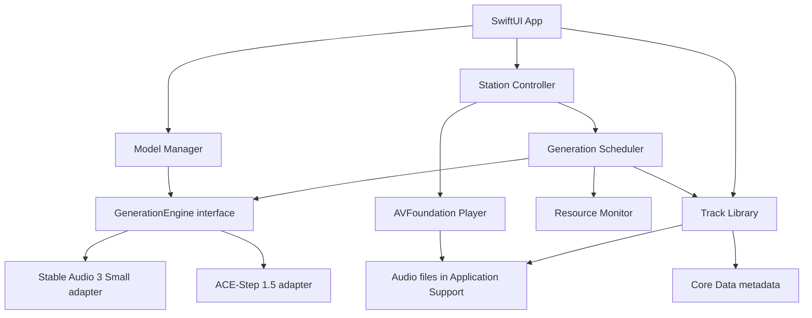

# Flowtone — Product Requirements Document

**Версия:** 0.1

**Статус:** Draft, готов к technical spike

**Дата:** 2026-08-16

**Владелец продукта:** mayky77-glitch

**Репозиторий:** [mayky77-glitch/Flowtone](https://github.com/mayky77-glitch/Flowtone)

## Change Log

| Версия | Дата | Изменение |
|---|---|---|
| 0.1 | 2026-08-16 | Первая версия после продуктового интервью и feasibility research |

## Статусы неизвестного

- 🔶 **Assumption** — правдоподобное, но ещё не проверенное допущение.
- 🔵 **Open Question** — решение или факт, который ещё нужно получить.

---

## 1. Executive Summary

Flowtone — бесплатное open-source приложение для владельцев Apple Silicon Mac, которым нужна фоновая музыка для работы и концентрации. Пользователь один раз задаёт жанры, энергию, темп, настроение и при желании текстовый вайб, после чего Flowtone локально генерирует инструментальные треки и воспроизводит их как непрерывную радиостанцию. Продукт убирает поиск плейлистов, рекламу, подписку и зависимость от интернета. Успех MVP означает, что пользователь может слушать станцию не менее часа без поиска другой музыки, а система способна поддерживать 6–10-часовую сессию без пауз и заметного перегрева.

🔶 **Assumption:** проблема характерна не только владельцу проекта, но и заметной группе пользователей Mac, работающих под фоновую музыку. Сейчас гипотеза основана только на личном опыте.

---

## 2. Problem Statement

### Кто сталкивается с проблемой

Основная аудитория — люди, которые работают или учатся за Mac и используют инструментальную музыку для концентрации: разработчики, дизайнеры, авторы, аналитики, студенты и другие knowledge workers.

### Проблема

Чтобы поддерживать подходящий музыкальный фон, пользователь вынужден искать плейлисты, переключать неподходящие треки, терпеть рекламу либо оплачивать подписку. Эти действия прерывают рабочий фокус. Стриминговые сервисы также зависят от сети и не дают пользователю полностью локальный генеративный поток.

### Почему это болезненно

- Переключение контекста ради выбора музыки мешает глубокой работе.
- Готовый плейлист может не соответствовать текущему темпу, энергии или настроению.
- Реклама и ограничения бесплатных тарифов создают дополнительные прерывания.
- Зависимость от интернета ухудшает автономность и приватность.
- Пользователь должен управлять музыкой вместо того, чтобы один раз настроить фон.

### Доказательства

- **Подтверждено:** личный опыт владельца продукта.
- 🔶 **Assumption:** другие пользователи описывают проблему теми же словами и считают её достаточно сильной для установки локальной модели размером несколько гигабайт.
- 🔵 **Open Question:** насколько часто потенциальные пользователи переключают музыку во время работы и готовы ли они заменить привычный стриминговый сервис.

### Discovery до публичной beta

Провести 5–8 интервью с владельцами Apple Silicon Mac, которые слушают музыку во время работы. Проверить текущие привычки, частоту прерываний, отношение к локальной модели, допустимый размер загрузки и качество, при котором они готовы слушать Flowtone не менее часа.

---

## 3. Target Users & Jobs-to-Be-Done

### Primary Persona

**Имя:** Алекс

**Контекст:** работает за Apple Silicon Mac по 1–8 часов в день, техническая подготовка средняя или высокая, регулярно включает фоновую музыку.

**Цель:** быстро войти в состояние концентрации и не управлять музыкой во время рабочей сессии.

**Боли:** поиск плейлистов, неуместные треки, реклама, интернет-зависимость, слишком активная или вокальная музыка.

**Текущее поведение:** выбирает готовый плейлист или радио, периодически переключает треки и меняет подборку.

🔶 **Assumption:** Алекс согласен один раз загрузить 2–10 ГБ моделей ради автономной работы.

### Jobs-to-Be-Done

- **Functional job:** «Когда я начинаю работу, я хочу один раз выбрать характер музыки и получить непрерывный инструментальный фон без дальнейшего управления».
- **Emotional job:** сохранять ощущение контроля, приватности и спокойствия, не отвлекаясь на музыкальный выбор.
- **Social job:** не является основным для MVP.

### Основной контекст

Сессия может длиться от короткого рабочего интервала до полного рабочего дня. Искусственного ограничения длительности нет.

---

## 4. Strategic Context

### Цель продукта

Проверить, может ли полностью локальная генерация стать практичной заменой фоновому стриминговому радио на Apple Silicon Mac без постоянной высокой нагрузки.

### Почему сейчас

- Современные Apple Silicon Mac имеют unified memory и локальные ML runtime, достаточные для компактных аудиомоделей.
- [Stable Audio 3](https://github.com/Stability-AI/stable-audio-3) предоставляет официальный Mac-путь для Small-модели.
- [ACE-Step 1.5](https://github.com/ace-step/ACE-Step-1.5) даёт более тяжёлый экспериментальный quality tier с Apple Silicon/MLX-путём.
- Уже существуют локальные движки и desktop-прототипы, но не найден готовый продукт с точным UX-контрактом Flowtone: настройка рабочей станции, низконагруженный буфер, постоянная коллекция и локальное бесконечное радио.

### Дифференциация

- Весь пользовательский контент и генерация остаются на Mac.
- UX начинается не с технического prompt-поля, а с параметров станции.
- Непрерывность важнее обязательной уникальности: при перегрузке или выключенной генерации разрешены повторы.
- Flowtone предлагает лёгкий и тяжёлый local engine, рекомендуя вариант по характеристикам Mac.
- Каждый созданный трек становится частью локальной коллекции.

### Модель распространения

- Бесплатное open-source приложение.
- Первая публичная сборка: подписанный и notarized `.dmg` через GitHub Releases.
- 🔵 **Open Question:** лицензия исходного кода должна быть выбрана до публичного релиза.
- Веса моделей не входят автоматически в лицензию Flowtone и скачиваются отдельно после показа соответствующих условий.

### Market Opportunity

TAM/SAM/SOM не рассчитывались. Для текущего open-source MVP это не блокирует technical spike, но ограничивает достоверность продуктового обоснования.

---

## 5. Solution Overview

### 5.1 Пользовательский сценарий

1. Пользователь устанавливает Flowtone из notarized `.dmg`.
2. Приложение определяет chip и объём unified memory.
3. Flowtone рекомендует лёгкую или тяжёлую модель; пользователь может изменить выбор.
4. Пользователь принимает условия модели и загружает её с отображением прогресса.
5. Пользователь выбирает один или несколько жанров, энергию, темп и настроение.
6. При желании добавляет свободное текстовое описание вайба.
7. Flowtone запускает станцию и поддерживает очередь готовых треков.
8. Во время сессии пользователь может менять параметры; новые значения применяются со следующего трека, текущий доигрывает.
9. При повторном запуске Flowtone немедленно включает случайный совместимый трек из локальной коллекции. При пустой коллекции показывает прогресс первой генерации.
10. Пользователь может поставить лайк, повторить, экспортировать или удалить трек, открыть историю и статистику хранилища.

### 5.2 Ключевые функции MVP

- Station setup: жанры, энергия, темп, настроение, необязательный vibe prompt.
- Непрерывный player: play/pause, следующий трек, громкость, плавные переходы.
- Последовательная фоновая генерация с опережающим буфером.
- Переключатель «Генерация включена/выключена».
- Автоматическая пауза генерации при высокой температуре или memory pressure.
- Повтор существующих треков как штатный fallback.
- Выбор local engine с автоматической рекомендацией.
- История, повтор трека, лайк, экспорт и локальная коллекция.
- Статистика: число и размер всех треков, число и размер по жанрам.
- Настраиваемый storage limit, индивидуальное удаление и «Удалить всё без лайка».
- Добровольные анонимные crash reports, выключенные по умолчанию.

### 5.3 Архитектура

### 5.4 Рекомендуемый стек

| Область | Выбор | Причина |
|---|---|---|
| UI | Swift 6, SwiftUI | Нативный macOS UX и небольшая runtime-надстройка |
| Playback | AVFoundation, `AVAudioEngine`/`AVAudioPlayerNode` | Gapless scheduling, crossfade и управление render clock |
| Concurrency | Swift Concurrency, actors | Один владелец очереди, отсутствие параллельных generation jobs |
| Metadata | Core Data | Локальная история, лайки, жанры, размеры и миграции без внешнего сервера |
| Audio storage | Application Support + security-scoped export | Локальное хранение и пользовательский экспорт |
| Light inference | Stable Audio 3 Small через Core ML или MLX adapter | Компактный instrumental engine с официальным Mac-путём |
| Heavy inference | ACE-Step 1.5 через изолированный MLX/helper process | Более тяжёлый quality tier без блокировки UI процесса |
| Packaging | Xcode, hardened runtime, codesign, notarization | Безопасный `.dmg` для GitHub Releases |
| Tests | XCTest, integration harness, 10-hour soak test | Проверка scheduler, storage и непрерывности |

🔶 **Assumption:** Core Data предпочтительнее SwiftData, пока не утверждена минимальная версия macOS. Решение можно пересмотреть после выбора deployment target.

### 5.5 Контракты компонентов

#### Station Controller

- Хранит активную конфигурацию станции и pending-конфигурацию.
- Изменения во время трека не влияют на current track.
- Передаёт pending-конфигурацию следующему generation job.
- Управляет переключателем генерации и fallback-политикой.

#### Prompt Composer

Преобразует параметры в структурированный prompt: жанр/веса жанров, tempo, energy, mood, optional vibe, instrumental-only и negative constraints для вокала.

Отдельный LLM в MVP не нужен: он увеличивает RAM и сложность. Свободный текст передаётся audio engine после лёгкой локальной нормализации и фильтрации. 🔵 **Open Question:** нужна ли маленькая локальная LLM позже для лучшей интерпретации русского вайба.

#### Generation Scheduler

- Не более одной generation job одновременно.
- Генерирует следующий трек, когда запас готового аудио падает ниже low-water mark.
- Проверяет thermal state, Low Power Mode и memory pressure перед стартом.
- При `thermalState == serious/critical` или существенном memory pressure откладывает job.
- После трёх последовательных ошибок открывает circuit breaker и переводит станцию в collection-only режим до ручного retry или cooldown.

🔶 **Assumption для spike:** трек 120 секунд, crossfade 6 секунд, current + 2 ready tracks. При таком режиме новый трек нужен примерно каждые 114 секунд. Параметры утверждаются после benchmark и прослушивания швов.

#### Playback Engine

- Планирует переходы по audio render clock, а не UI timer.
- Не ждёт модель и играет только готовые файлы.
- Не прерывает current track при изменении настроек.
- Если ready queue пуста, выбирает least-recently-played совместимый трек; при старте станции выбор случайный среди совместимых.
- Перед crossfade применяет loudness normalization и базовую проверку silence/clipping.

#### Model Manager

- Определяет hardware class и рекомендует engine.
- Показывает размер, требования, лицензию и ожидаемую нагрузку.
- Поддерживает resumable download, checksum и повтор после ошибки.
- Проверяет свободное место до загрузки.
- Позволяет удалить неиспользуемую модель.
- Не блокирует ручной выбор тяжёлой модели, но показывает предупреждение.

#### Track Library

Минимальная metadata-схема:

- `id`, `createdAt`, `lastPlayedAt`, `playCount`;
- жанры и их веса, energy, tempo, mood, vibe;
- engine, model version, seed и параметры генерации;
- duration, format, file path, byte size;
- `liked`, `generationStatus`, `qualityStatus`.

Каждый успешно созданный трек сохраняется. Лайк защищает его от автоматической очистки. При превышении пользовательского лимита удаляются самые старые треки без лайка, кроме current/ready. Если защищённые треки сами заняли лимит, Flowtone предупреждает пользователя и не удаляет их автоматически.

При массовой очистке приложение показывает число и объём затронутых файлов и требует подтверждение.

### 5.6 Модельные tiers

| Tier | Предварительный engine | Hardware | Статус |
|---|---|---|---|
| Light | Stable Audio 3 Small-Music | M1+, 8 ГБ minimum; 16 ГБ recommended | Основной кандидат MVP |
| Quality | ACE-Step 1.5 | 24 ГБ+ recommended | Экспериментальный, зависит от benchmark |

Все hardware-пороги — 🔶 **Assumption**. Обязателен benchmark минимум на M1/8 ГБ, M1 или M2/16 ГБ и современном Mac/24–32 ГБ.

Stable Audio code и model weights имеют разные условия. Для весов действует [Stable Audio Community License](https://stability.ai/license). ACE-Step также требует отдельной проверки code/model/data terms перед релизом.

### 5.7 Оценка хранилища

При 120-секундных WAV 44.1 kHz stereo 16-bit один трек занимает около 21 МБ. С crossfade 6 секунд получается около 31.6 новых трека в час, то есть примерно 0.67 ГБ/час или 6.7 ГБ за 10-часовую сессию.

🔶 **Assumption:** архивное хранение в M4A/AAC 256 kbps уменьшит объём примерно до 3.8 МБ на трек и 1.2 ГБ за 10 часов. Нужно проверить, устраивает ли качество и не создаёт ли транскодирование заметную нагрузку.

---

## 6. Success Metrics

### Primary Metric

**Focus Session Success:** пользователь завершает минимум 60 минут прослушивания, не уходя искать другую музыку и не управляя очередью вручную.

- **Baseline:** отсутствует.
- **MVP acceptance:** сценарий проходит у владельца продукта.
- 🔵 **Open Question:** целевая доля успешных сессий во внешней beta после появления baseline.

### Reliability Metrics

| Метрика | Цель MVP |
|---|---|
| Buffer underruns в 10-часовом soak test | 0 |
| Необработанные падения в 10-часовом soak test | 0 |
| Старт воспроизведения из существующей коллекции | 🔶 не более 2 секунд |
| Потеря metadata после штатного завершения/перезапуска | 0 |
| Удаление лайкнутых файлов автоматической очисткой | 0 |

### Resource Guardrails

- Flowtone не должен приводить систему в sustained `thermalState == critical`.
- UI и playback не должны зависать во время inference.
- Одновременно выполняется максимум одна generation job.
- При memory pressure или высокой температуре scheduler прекращает новые jobs и продолжает playback из коллекции.
- 🔵 **Open Question:** численные p50/p95 latency, peak memory и средняя duty cycle для каждого hardware tier определяются benchmark.

### Product Validation Metrics

Для beta измерять только локально либо собирать вручную в исследовании, поскольку usage analytics не входят в MVP:

- длительность сессии;
- число skips за час;
- доля сессий, закончившихся из-за неподходящей музыки;
- доля повторных запусков в течение недели;
- число лайков на час генерации.

---

## 7. User Stories & Requirements

### Epic Hypothesis

Мы считаем, что локальная инструментальная радиостанция с настройкой жанра и вайба позволит пользователям Mac работать не менее часа без поиска другой музыки, потому что Flowtone заранее генерирует подходящие треки и продолжает играть из локальной коллекции при любой доступности генератора. Проверка: 60-минутные пользовательские сессии, 10-часовой soak test и resource benchmark.

### Story 1 — Первый запуск и установка модели

Как новый пользователь, я хочу получить подходящую для моего Mac модель без ручной настройки окружения, чтобы быстро запустить станцию.

**Acceptance Criteria:**

- [ ] Flowtone определяет Apple Silicon chip и объём unified memory.
- [ ] Показывает рекомендуемую модель, размер загрузки и требования.
- [ ] До загрузки показывает условия модели и требует подтверждение.
- [ ] Проверяет свободное место.
- [ ] Показывает прогресс, поддерживает retry и продолжение прерванной загрузки.
- [ ] Проверяет checksum перед активацией модели.
- [ ] При ошибке не оставляет модель в состоянии «готова».

### Story 2 — Настройка станции

Как пользователь, я хочу выбрать характер музыки, чтобы получить подходящий фон для текущей работы.

**Acceptance Criteria:**

- [ ] Можно выбрать один или несколько жанров.
- [ ] Energy, tempo и mood обязательны.
- [ ] Текстовый vibe необязателен.
- [ ] Станция не запускается без обязательных параметров.
- [ ] Prompt содержит instrumental-only constraint.

### Story 3 — Непрерывное воспроизведение

Как пользователь, я хочу, чтобы музыка не останавливалась из-за генерации, чтобы не терять концентрацию.

**Acceptance Criteria:**

- [ ] Player использует готовые локальные файлы и не ждёт inference в audio callback.
- [ ] Scheduler поддерживает current + ready buffer.
- [ ] Между треками выполняется плавный переход без слышимой тишины.
- [ ] При пустом ready buffer выбирается существующий совместимый трек.
- [ ] Повтор разрешён при высокой нагрузке, ошибке или выключенной генерации.
- [ ] 10-часовой soak test проходит без buffer underrun.

### Story 4 — Изменение станции во время сессии

Как пользователь, я хочу менять жанр, энергию, темп, настроение и вайб без остановки музыки.

**Acceptance Criteria:**

- [ ] Изменения сохраняются как pending configuration.
- [ ] Текущий трек доигрывает без прерывания.
- [ ] Следующий generation job использует новые параметры.
- [ ] UI показывает, что изменения вступят в силу со следующего трека.

### Story 5 — Управление генерацией и fallback

Как пользователь, я хочу выключить генерацию или продолжить слушать при перегрузке Mac.

**Acceptance Criteria:**

- [ ] Есть переключатель «Генерация включена/выключена».
- [ ] Выключение не останавливает current track.
- [ ] При выключенной генерации станция использует локальную коллекцию.
- [ ] При thermal/memory pressure новая job не начинается.
- [ ] Пользователь видит ненавязчивый статус «Генерация приостановлена, играет коллекция».
- [ ] После нормализации ресурсов генерация возобновляется автоматически, если переключатель включён.

### Story 6 — Выбор модели

Как пользователь, я хочу выбрать баланс качества и нагрузки, подходящий моему Mac.

**Acceptance Criteria:**

- [ ] Flowtone показывает рекомендованный tier.
- [ ] Пользователь может выбрать другой установленный engine.
- [ ] Выбор выше рекомендуемого tier требует подтверждения предупреждения.
- [ ] Смена engine применяется к будущим generation jobs и не ломает playback.
- [ ] Можно удалить веса неактивной модели, не удаляя созданные треки.

### Story 7 — Лайки, история и экспорт

Как пользователь, я хочу сохранить удачные результаты и возвращаться к ним.

**Acceptance Criteria:**

- [ ] Каждый успешно созданный трек появляется в истории и библиотеке.
- [ ] Лайк можно поставить и снять из player и библиотеки.
- [ ] Лайкнутый трек не удаляется автоматической очисткой.
- [ ] Трек можно воспроизвести повторно.
- [ ] Трек можно экспортировать в выбранную пользователем папку.
- [ ] Экспорт не меняет оригинал в библиотеке.

### Story 8 — Статистика и очистка хранилища

Как пользователь, я хочу понимать, сколько места занимает Flowtone, и безопасно освобождать диск.

**Acceptance Criteria:**

- [ ] Показаны общее число треков и общий размер.
- [ ] Показаны количество и размер по каждому жанру.
- [ ] Пользователь задаёт storage limit.
- [ ] Можно удалить отдельный трек, кроме current/ready.
- [ ] Команда «Удалить всё без лайка» показывает количество и объём до подтверждения.
- [ ] Массовая и автоматическая очистка не затрагивают лайкнутые, current и ready tracks.
- [ ] При превышении лимита защищёнными треками приложение предупреждает пользователя.

### Story 9 — Быстрый повторный запуск

Как возвращающийся пользователь, я хочу услышать музыку сразу, не ожидая новой генерации.

**Acceptance Criteria:**

- [ ] При наличии совместимых треков Flowtone случайно выбирает один из них.
- [ ] Приложение не обязано начинать с последнего проигранного трека.
- [ ] При отсутствии совместимых треков используется любой доступный instrumental track с пояснением либо запускается генерация.
- [ ] При полностью пустой коллекции показывается прогресс первой генерации.

### Story 10 — Приватность и crash reports

Как пользователь, я хочу, чтобы мои запросы и музыка оставались на Mac.

**Acceptance Criteria:**

- [ ] Prompt, station settings, history и audio не отправляются во внешние сервисы.
- [ ] Crash reporting выключен по умолчанию.
- [ ] Включение требует явного opt-in.
- [ ] Отчёты не содержат prompt, audio, имена или полные пути файлов.
- [ ] Пользователь может отключить crash reporting в любой момент.

### Нефункциональные требования

- Только Apple Silicon M1 и новее; Intel не поддерживается.
- Light tier ориентирован на 8 ГБ, 16 ГБ рекомендуется; Quality tier — на 24 ГБ+ до уточнения benchmark.
- Полная работа offline после загрузки модели.
- Playback имеет приоритет над generation и storage maintenance.
- Все metadata migrations должны сохранять лайки и связь с файлами.
- Частично записанный или не прошедший quality check файл не попадает в библиотеку.
- Удаление модели не удаляет пользовательскую музыку.
- Никаких API keys или пользовательских токенов в репозитории и логах.

---

## 8. Out of Scope

Не входят в первую версию:

- вокал и генерация текстов песен;
- облачная генерация и обязательные hosted API;
- аккаунты, cloud sync и совместные библиотеки;
- iOS, Windows и Intel Mac;
- социальная лента и публикация треков;
- ручное редактирование, stems, remix и DAW-функции;
- обучение моделей и LoRA;
- профессиональный beatmatching и гарантированно DJ-quality transitions;
- Mac App Store и Homebrew Cask;
- отдельный дизлайк как обучающий сигнал;
- таймер остановки;
- обязательная уникальность каждого трека.

Future candidates: влияние лайков на генерацию, presets станций, более умный подбор из коллекции, аудио-анализ переходов и маленькая локальная LLM для нормализации vibe prompt.

---

## 9. Dependencies & Risks

### Dependencies

- Apple Developer account, signing certificate и notarization pipeline.
- Доступный и юридически корректный способ загрузки model weights.
- Stable Audio 3 Small Core ML/MLX runtime.
- ACE-Step 1.5 runtime для необязательного quality tier.
- Выбранный crash-reporting provider с локальной redaction.
- Реальные Apple Silicon устройства для benchmark matrix.

### Risks and Mitigations

| Риск | Тип | Mitigation |
|---|---|---|
| Проблема подтверждена только личным опытом | Value | 5–8 discovery interviews и 60-минутные наблюдаемые beta sessions до расширения scope |
| Музыка быстро кажется однообразной или отвлекающей | Value/Usability | Набор benchmark prompts, слепое прослушивание, genre diversity rules, быстрый skip и fallback |
| 8 ГБ недостаточно даже для light tier рядом с рабочими приложениями | Feasibility | Отдельный M1/8 ГБ benchmark; conservative scheduler; выгрузка модели при memory pressure; честное изменение minimum requirements |
| ACE-Step нестабилен или слишком тяжёл на macOS | Feasibility | Оставить experimental tier; Stable Audio 3 Small — независимый baseline; изолировать heavy engine в helper process |
| Gated model download нельзя прозрачно автоматизировать | Viability/Legal | Проверить redistribution и auth flow до UI реализации; не встраивать чужой токен; показать terms пользователю |
| Лицензии кода, весов и outputs несовместимы с релизом | Legal | Отдельный license review и файл third-party notices; не путать open-source app с лицензией weights |
| WAV быстро заполняет диск | Usability | Storage dashboard, user limit, cleanup unliked, benchmark M4A archive format |
| Bulk cleanup удаляет нужную музыку | Usability | Лайк-защита, preview count/size, подтверждение, запрет удаления current/ready; решить undo/recovery до релиза |
| Crossfade создаёт музыкально плохие швы | Quality | Equal-power crossfade baseline, loudness normalization, genre-specific duration; beatmatching оставить вне MVP |
| Генерация вызывает перегрев и мешает работе | Feasibility | Одна job, thermal/memory gates, collection fallback, длительный resource benchmark |
| Crash report раскрывает локальные данные | Privacy | Opt-in, allowlist полей, path/prompt redaction, тест payload перед включением provider |
| Название Flowtone конфликтует с товарным знаком | Legal | Проверка App Store, доменов и товарных знаков до публичного брендинга |
| Обновление модели меняет качество или ломает старые настройки | Maintainability | Хранить model/version/seed в metadata; versioned adapters; не обновлять веса молча |

---

## 10. Open Questions

| Вопрос | Owner | Deadline | Статус |
|---|---|---|---|
| Какая open-source лицензия используется: MIT, Apache-2.0, GPLv3 или другая? | Владелец продукта | До public release | Open |
| Какова минимальная версия macOS? | Engineering | После engine spike | Open |
| Реально ли поддержать Stable Audio 3 Small на M1/8 ГБ рядом с рабочей нагрузкой? | Engineering | До MVP implementation | Open |
| Как проходит легальная загрузка gated Stable Audio weights без встроенного токена? | Engineering/Legal | До Model Manager | Open |
| Проходит ли ACE-Step 1.5 длительный MLX soak test на 24–32 ГБ Mac? | Engineering | До включения Quality tier | Open |
| Какой внутренний формат: WAV или M4A, и какой default storage limit? | Product/Engineering | После storage benchmark | Open |
| Нужны ли Trash/Undo/Recently Deleted для массовой очистки? | Product | До Library implementation | Open |
| Какой crash-reporting provider использовать? | Maintainer | До public beta | Open |
| Какая доля внешних 60-минутных сессий считается product success? | Product | После первых 5–8 интервью | Open |
| Должны ли лайки позже менять жанровые веса и prompt? | Product | После MVP | Deferred |
| Доступно ли название Flowtone для публичного использования? | Владелец продукта | До public release | Open |

---

## Delivery Plan

### Slice 0 — Technical Spike

- Stable Audio 3 Small: download, один 120-секундный instrumental track, timing/RAM/thermal measurement.
- Тесты на M1/8 ГБ, 16 ГБ и 24–32 ГБ.
- Проверка Core ML против MLX.
- ACE-Step quality spike отдельно, не блокирует baseline.
- Решение по internal audio format.

### Slice 1 — Radio Core

- SwiftUI shell, station config, player, current + 2 ready buffer.
- Stable Audio adapter, serial scheduler, resource monitor.
- Fallback на существующие файлы и 10-часовой soak test.

### Slice 2 — Library

- Core Data metadata, history, likes, export.
- Storage statistics, limit, individual and bulk cleanup.
- Random compatible track on startup.

### Slice 3 — Public Beta

- Model Manager с terms/checksum/resume.
- Opt-in crash reporting и privacy review.
- Signing, notarization, `.dmg`, GitHub Release.
- Discovery interviews и наблюдаемые 60-минутные sessions.

---

## PRD Self-Assessment

### Strongest Section

Solution and runtime contract: определены offline boundary, playback buffer, fallback, resource protection, storage semantics и два model tiers.

### Weakest Section

Problem validation and product targets: пока есть только личный опыт, нет интервью, baseline и внешней beta.

### Top Assumptions to Validate

| # | Assumption | Риск, если неверно | Проверка |
|---|---|---|---|
| 1 | Пользователям нужен локальный генеративный фон вместо готовых плейлистов | Продукт не будут регулярно запускать | 5–8 interviews + clickable concept test |
| 2 | Stable Audio 3 Small работает комфортно на M1/8 ГБ | Заявленный minimum hardware неверен | Benchmark рядом с типичной рабочей нагрузкой |
| 3 | Качества хватает для 60 минут концентрации | Пользователь уйдёт к стримингу | Слепые 60-минутные listening sessions |
| 4 | M4A archive приемлем и заметно снижает storage cost | Либо плохое качество, либо быстрый рост диска | A/B listening + encode/load benchmark |
| 5 | Heavy tier полезен и стабилен на 24–32 ГБ | Лишняя сложность Model Manager и support | ACE-Step soak test до включения в beta |

### Recommended Next Step

Не начинать полное приложение. Сначала выполнить Slice 0: воспроизводимый benchmark Stable Audio 3 Small на реальных Mac и 5–8 коротких discovery interviews. Если light engine не выдерживает ресурсный guardrail или музыка не выдерживает 60-минутное прослушивание, пересмотреть hardware minimum либо саму концепцию до разработки UI.
